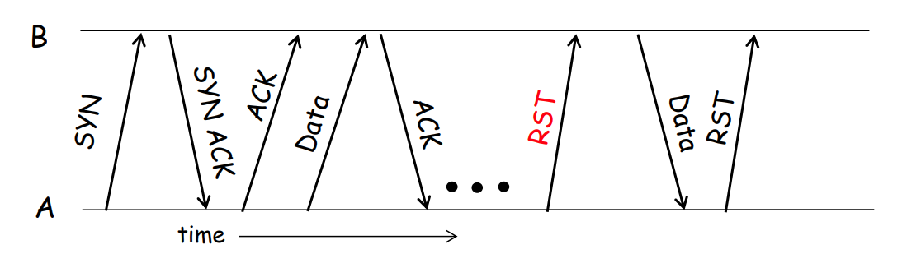

### **运输层-2**  
（按协议分类结构化呈现，含关键机制对比与流程图）

---

#### **1. UDP协议**  
**特点与用途**  
- **无连接**：无需握手，直接发送数据报。  
- **不可靠**：无重传、无顺序保证，可能丢包或乱序。  
- **低开销**：头部仅8字节（源/目标端口、长度、校验和）。  
- **典型应用**：  
  - 实时流媒体（VoIP、视频会议）  
  - DNS查询  
  - SNMP网络管理  

**UDP报文格式**  
```
| 源端口(16) | 目标端口(16) |
| 长度(16)   | 校验和(16)   |
| 应用数据（可变长度）        |
```
**校验和计算**  
- 覆盖报文头、数据及伪头部（IP头部分字段）。  
- 16位反码求和，结果取反存入校验和字段。  

---

#### **2. TCP协议**  
**核心特性**  
- **可靠传输**：通过序列号、确认应答（ACK）、超时重传实现。  
- **面向连接**：三次握手建立连接，四次挥手释放连接。  
- **流量控制**：滑动窗口机制动态调整发送速率。  
- **拥塞控制**：慢启动、拥塞避免等算法（后续章节详述）。  

**TCP报文头关键字段**  
```
| 源端口(16) | 目标端口(16) |
| 序列号(32) | 确认号(32)   |
| 数据偏移(4)| 保留(6) | 标志位(6) | 窗口大小(16) |
| 校验和(16) | 紧急指针(16) |
| 选项（可选） | 填充        |
```
**标志位说明**：  
- `SYN`：同步序列号（连接建立）  
- `ACK`：确认字段有效  
- `FIN`：释放连接  
- `RST`：重置异常连接  

---

#### **3. TCP连接管理**  
**三次握手流程**  
1. **SYN**：客户端发送`SYN=1, seq=x`（随机初始序列号）。  
2. **SYN-ACK**：服务端回复`SYN=1, seq=y, ack=x+1`。  
3. **ACK**：客户端确认`ACK=1, seq=x+1, ack=y+1`。  
```
Client                           Server
  |                                |
  |-------- SYN (seq=x) ---------->|  
  |<----- SYN+ACK (seq=y, ack=x+1) |  
  |-------- ACK (ack=y+1) -------->|  
  |                                |
  |        连接建立成功             |

```

**四次挥手流程**  
1. **FIN**：主动方发送`FIN=1, seq=u`。  
2. **ACK**：被动方确认`ACK=1, ack=u+1`。  
3. **FIN**：被动方发送`FIN=1, seq=v`。  
4. **ACK**：主动方确认`ACK=1, ack=v+1`，进入`TIME_WAIT`状态（等待2MSL）。
```
Client                          Server
  |                               |
  |-------- FIN (seq=u) --------->|  
  |<------- ACK (ack=u+1) --------|  
  |                               |
  |<------- FIN (seq=v) ----------|  
  |-------- ACK (ack=v+1) ------->|  
  |                               |
  |        连接完全关闭            |
```

**状态机关键节点**  
- **客户端**：`SYN_SENT` → `ESTABLISHED` → `FIN_WAIT_1` → `FIN_WAIT_2` → `TIME_WAIT` → `CLOSED`  
- **服务端**：`LISTEN` → `SYN_RCVD` → `ESTABLISHED` → `CLOSE_WAIT` → `LAST_ACK` → `CLOSED`  

---

#### **4. TCP可靠传输机制**  
**序列号与确认**  
- **序列号**：字节流中每个字节的编号（非报文编号）。  
- **确认号**：`ACK=N`表示期望接收第N字节数据（累计确认）。  

**超时重传与快速重传**  
- **超时重传**：基于动态计算的RTO（Retransmission Timeout）。  
  - `EstimatedRTT = (1-α)*EstimatedRTT + α*SampleRTT`  
- **快速重传**：收到3个重复ACK时立即重传丢失报文。  

**滑动窗口**  
- **发送窗口**：已发送未确认的字节范围。  
- **接收窗口**：通告对方可接收的字节数（流量控制）。  

---

#### **5. 停等协议与比特交替协议**  
**停等协议**：  
- **原理**：每发送一个报文，等待ACK后再发下一个。  
- **缺点**：效率低（吞吐量 ≈ `数据大小/RTT`）。  

**比特交替协议**：  
- **改进**：为每个报文分配0/1序号，接收方通过序号确认，允许连续发送。  
- **示例**：  
  ```
  发送方：发送P0 → 等ACK0 → 发送P1 → 等ACK1...  
  接收方：ACK0确认P0，ACK1确认P1。  
  ```

---

#### **6. 回退N步（GBN）与选择重传（SR）**  
| **特性**       | **GBN**                              | **SR**                              |  
|----------------|--------------------------------------|-------------------------------------|  
| **重传范围**   | 重传整个窗口（从第一个未确认包开始） | 仅重传丢失的包                      |  
| **接收方处理** | 丢弃乱序包                           | 缓存乱序包                          |  
| **复杂度**     | 低（单一计时器）                     | 高（每个包需独立计时器）            |  
| **适用场景**   | 低错误率环境                         | 高错误率环境                        |  

---

#### **7. 关键对比与示意图**  
**TCP vs UDP**  
| **特性**       | **TCP**                  | **UDP**                  |  
|----------------|--------------------------|--------------------------|  
| **连接方式**   | 面向连接（三次握手）     | 无连接                   |  
| **可靠性**     | 可靠（确认、重传）       | 不可靠                   |  
| **头部开销**   | 20字节（含选项）         | 8字节                    |  
| **适用场景**   | HTTP、FTP、SSH           | DNS、视频流、实时游戏    |  

**TCP三次握手与四次挥手流程图**  
```
三次握手：  
Client → Server: SYN  
Server → Client: SYN-ACK  
Client → Server: ACK
```

```
四次挥手：  
A → B: FIN  
B → A: ACK  
B → A: FIN  
A → B: ACK  
```

